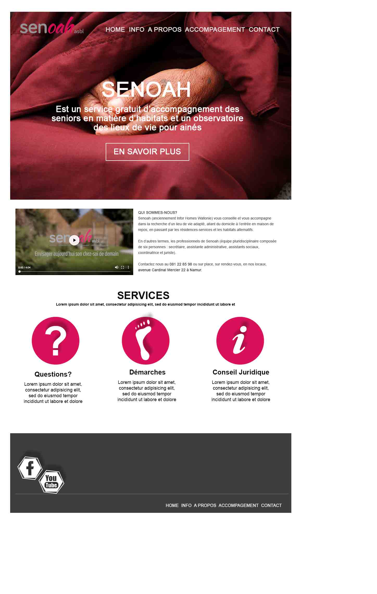

# Senoah - Service d'accompagnement des seniors. ASBL
- **Client** : [Senoah](http://www.senoah.be/)

- **Where ?** : [BeCode](https://www.becode.org/)
- **When ?** :  30/07 - 10/08/2018
- **By who ?** :
- [Meylin Andrade](https://github.com/Meilyn)
- [Cédric Fournier](https://github.com/Cedric-Fournier)
- **The Website** : linkhere

## Demande client :
Un site multipage avec un formulaire de contact fonctionnel
"J'ai besoin de rafraîchir mon site internet. J'aurais besoin d'un site avec plusieurs pages pour bien séparer le contenu."
"J'aimerais bien que les visiteurs de mon site puissent m'envoyer un mail via un formulaire de contact avec une petite photo."

## Maquette du projet :

## Project Board :
[KANBAN](https://github.com/Meilyn/multipage-website-in-php/projects/1)
